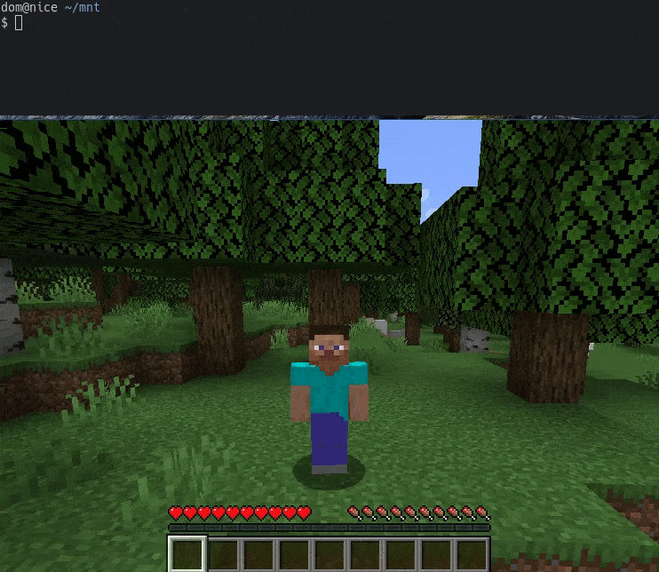
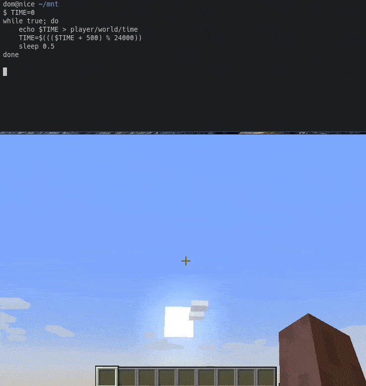

# minecraft-fs

[](https://github.com/DomWilliams0/minecraft-fs/actions/workflows/build.yml)
[](https://github.com/XAMPPRocky/tokei)

A FUSE filesystem for querying and controlling Minecraft, as a universal mod platform (but mainly
for fun).

*Warning: don't get your hopes too high, this is still WIP!*

* * *


# What?

This plugin makes it possible to control your game through the filesystem, and therefore with common
Unix tools like `cat`, `find`, `grep` etc. This means you can easily write Minecraft mods with 
languages like bash and Python without needing to touch Java, gradle or Fabric.

# Why?

For fun, to learn about FUSE, but most importantly - why not?

# Examples

## Controlling the player


## Teleporting


## Teleporting others to the player


## Setting health


## Controlling the time


## Setting blocks


# Scripting

In [./scripts](./scripts) you can find some python that encapsulates the filesystem structure and
makes for a nicer scripting experience. See [the demo script](./scripts/demo.py) for some examples.

```python
import common
mc = Minecraft.from_args()

player = mc.player()
print(f"{player.name} is at {player.position}")

player.kill()
```

# Usage

Once installed (see below), start Minecraft and join a **single player** world. There's currently no
support for multiplayer worlds.

Your `mnt` directory should contain the following:

```bash
$ cd mnt
$ ls
player  version  worlds

$ ls -l player
drwxr-xr-x   - dom 21 Feb 20:27 control
lrwxr-xr-x   0 dom 21 Feb 20:27 entity -> world/entities/by-id/135
.rwxr-xr-x 256 dom 21 Feb 20:27 health
.rwxr-xr-x 256 dom 21 Feb 20:27 name
.rwxr-xr-x 256 dom 21 Feb 20:27 position
lrwxr-xr-x   0 dom 21 Feb 20:27 world -> ../worlds/overworld
```

Congratulations, you can now manipulate the game through reading and writing to these special files.

## Directory structure

```asm
├── player
│   ├── control    ; all the files here are write-only
│   │   ├── jump   ; causes the player to jump on any input
│   │   ├── move   ; applies the given x,y,z force to the player
│   │   └── say    ; makes the player chat
│   ├── entity -> world/entities/by-id/135  ; symlink to player entity
│   ├── health    ; rw, the player's health
│   ├── name      ; ro, the player's name
│   ├── position  ; rw, the player's position
│   └── world -> ../worlds/overworld  ; symlink to player world
└── worlds
    ├── end
    │   ├── blocks
    │   │   ├── 100,64,250
    │   │   │   ├── adjacent  ; dir of symlinks to adjacent blocks
    │   │   │   │   ├── above -> ../../100,65,250
    │   │   │   │   ├── below -> ../../100,63,250
    │   │   │   │   ├── east -> ../../101,64,250
    │   │   │   │   ├── north -> ../../100,64,249
    │   │   │   │   ├── south -> ../../100,64,251
    │   │   │   │   └── west -> ../../99,64,250
    │   │   │   ├── pos    ; ro, this block's position
    │   │   │   └── type   ; rw, the block's type
    │   │   ├── 100.2 64.555 250.1223  ; this works too
    │   │   │   └── ...
    │   │   └── README  ; ro, explains the dir structure
    │   ├── entities
    │   │   └── by-id
    │   │       ├── 107  ; entity id
    │   │       │   ├── health     ; rw, the entity's health
    │   │       │   ├── living     ; inaccessible, present if living
    │   │       │   ├── position   ; rw, the entity's position
    │   │       │   └── type       ; ro, the entity's type
    │   │       ├── 108
    │   │       │   ├── health
    │   │       │   ├── living
    │   │       │   ├── position
    │   │       │   └── type
    │   │       ...
    │   └── time  ; rw, the world's time
    ├── nether
    │   ├── blocks
    │   │   └── ...
    │   ├── entities
    │   │   └── ...
    │   └── time
    └── overworld
        ├── blocks
        │   └── ...
        ├── entities
        │   └── ...
        └── time
```

# Installation

TODO: download mod jar and mcfuse binary from github actions, install fabric mod, run game, start
mcfuse and specify mnt directory

# TODOs

* More endpoints
    * [X] player gamemode
    * [X] entity hunger
    * [ ] better player movement
    * [ ] entity looking direction (yaw,pitch,roll)
    * [X] entity target pos
    * [ ] symlink to entity vehicle
* Inventory management
    * [ ] individual slots
    * [ ] symlink to current slot, armour, other hand
    * [ ] give/spawn items
* More block control
*   * [ ] orientation
    * [ ] nbt tags
* [X] Entity spawning
* More entity filters than `by-id`
    * [ ] by-type
    * [ ] by-proximity-to a position and radius
* Server settings
    * [ ] game rules
    * [ ] pvp
    * [ ] difficulty
    * [ ] weather
* Event file for reacting to events
    * [ ] `tail`able file of events such as player chat
* Client specific things
    * [ ] pause/unpause game
    * [ ] load into world, stop server
* Multiplayer support
    * [ ] install as a server mod, control the server world
    * [ ] install as a client mod and join an unmodded server, at least control the player
